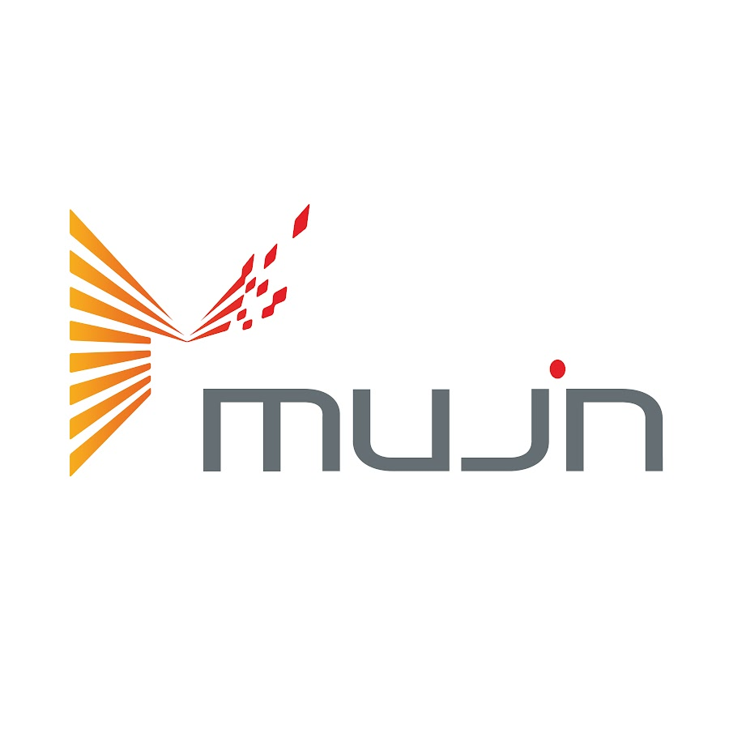

## Experience

### [Mujin Inc. (August 2022 - December 2022)](https://mujin-corp.com/)

For my second Co-Op I was given a once in a lifetime opportunity to work for Mujin Inc. in Tokyo, Japan. Mujin creates robotic integration solutions with their controllers. These controllers run OpenRAVE to integrate sensors, motors, and artificial intelligence. 

Previously OpenRAVE required all files to be installed locally to properly run, this required constant updates and synchronization between all connected controllers. During my internship, I created a plugin for OpenRAVE to allow for files to be remotely loaded in over CURL. This was implemented in C++.

Other projects during my internship included Python robot navigation demos for Toyota at Logistech 2022 and revamping C++ drivers for Canon RV computer vision cameras. 

### [Amazon Robotics (September 2021 - December 2021)](https://www.aboutamazon.com/news/tag/robotics)

My first Co-Op was at Amazon Robotics in the Innovation Lab in Westborough, Massachusetts. Here I updated C++ drivers for FANUC robot arms. My code would receive path planning instructions then queue its movement. FANUC arms don't natively understand C++, so my code had to generate Teach Pendant (TP) navigation to control the robot movement. My other contributions were to Programmable Logic Controllers and network integrations. 