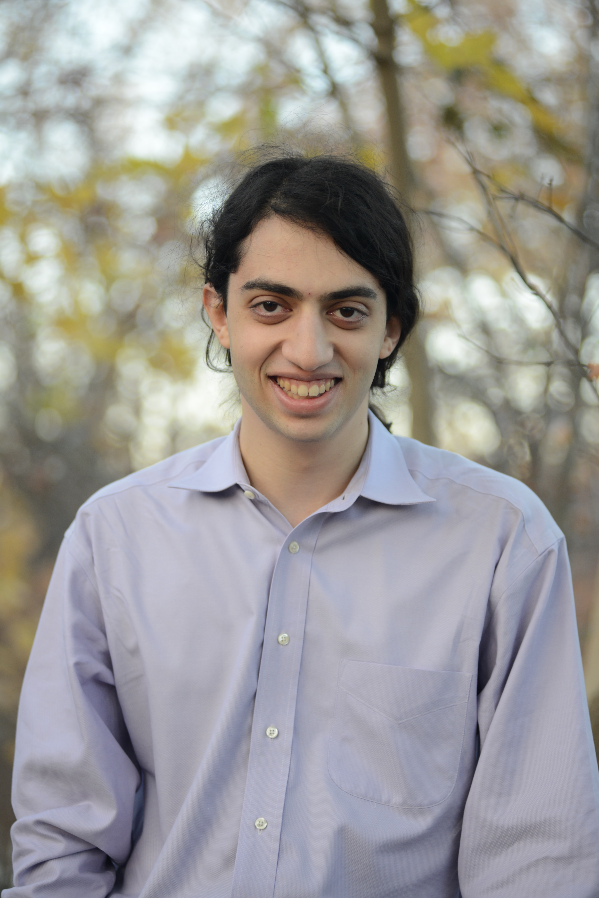

<head>
    <title>jberman.dev</title>
</head>

# [About](index.md) | [Experience](experience/index.md) | [Projects](projects/index.md) | [Contact](contact/index.md) | [Resume](resume/index.md)

I am a computer engineer with an interest in embedded and firmware design. My code bridges the real world with the digital world. I always get excited when I see my code cause physical world changes. In 2024, I completed my Master of Science in Electrical and Computer Engineering with a Concentration in Computer Systems and Software from Northeastern University. I enjoy coding in C, C++, and Verilog.

Outside of coding I love photography! I've even been an official photographer for the Boston Marathon. I am self taught and have come a long way since I've started. 

