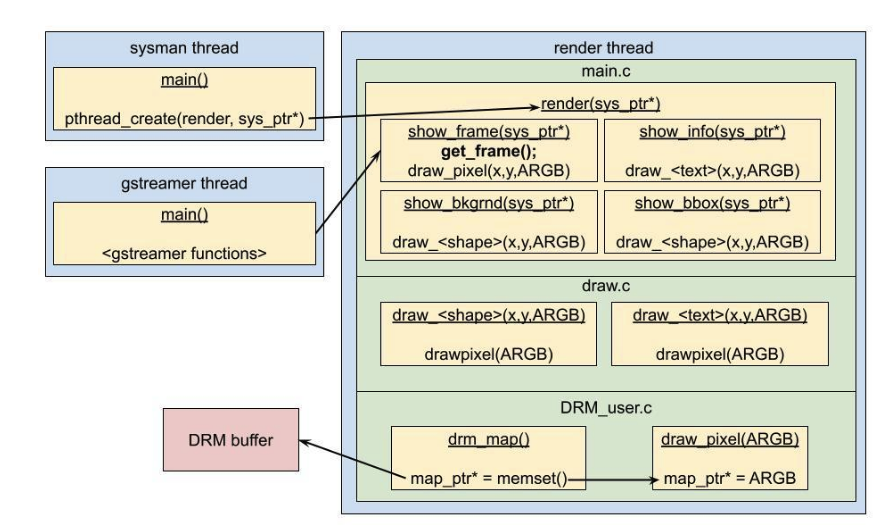
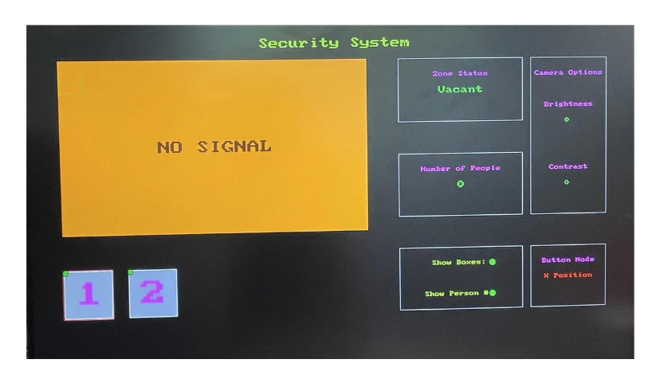

## Bomba Security System

### Class security system project

#### Contribution: HDMI driver

For EECE4534, Microprocessor-based Design, we had a class group project. As a class we decided to create security camera system that would connect multiple Avent Zedboards together and detect movement. My contribution was interfacing with the Direct Rendering Manager (DRM) to display through the embedded HDMI port. DRM exists in kernel space where it will take buffers and fairly display them as opposed to multiple processes competing for the video card. 

My code was at the lowest level of the rendering hierarchy. DRM_user.c would directly talk to the DRM buffer, which would then display through HDMI. The DRM buffer was opened at /dev/dri/card0 and its memory region accessed with mmap. DRM_user.c would have an outward facing API, draw_pixel(), which would take the shapes drawn from a higher in the hierarchy and place them into the image buffer. 

An improvement that identified was the speed of which pixels were copied. Draw_pixel would take a 32 bit long array [Alpha[8], Red[8], Green[8], Blue[8]] and copy them one bit at a time. A memcpy() would result in a faster copying speed which would allow for frames to be displayed faster. 

The finalized UI being rendered 

Some pixel test examples

