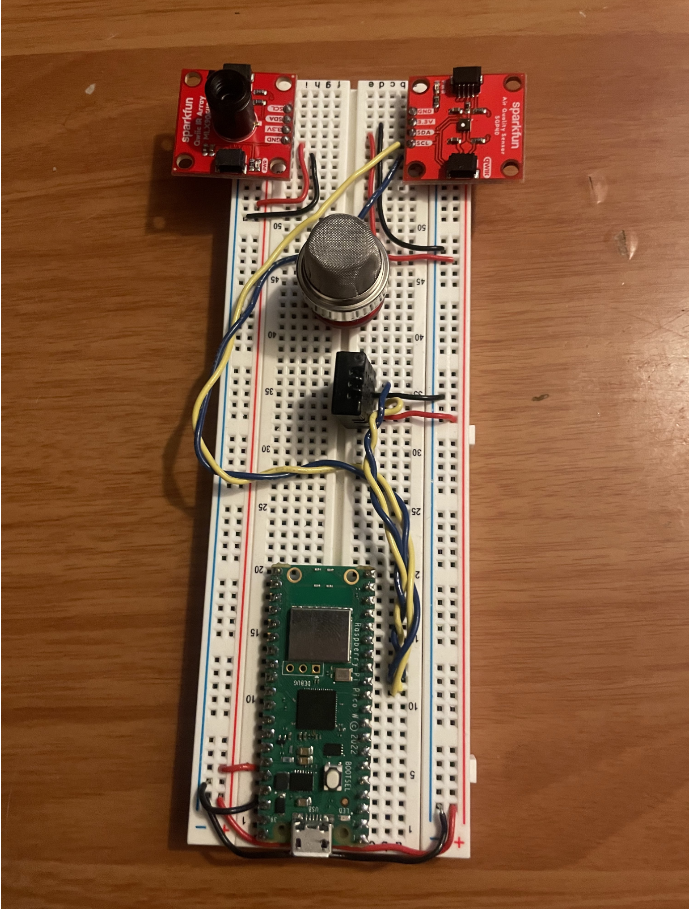
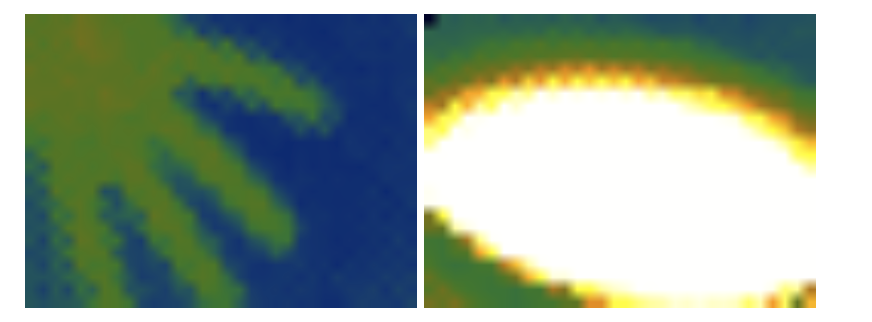

## CookAware

### Capstone smart kitchen

Kitchen fires are the leading cause of house fires. For my capstone project, my group elected to create a sensor network to detect and warn users of hazards that may occur before a fire. 

My contributions to the project was creating the sensor network and broadcast data to the central node. 

### Microcontroller

I selected the Raspberry Pi Pico W for our microcontroller. The Pico W uses Raspberry Pi's recent chip, the RP2040, a dual-core ARM cortex processor. It also has an embedded CYW43439 WiFi chip. With these features at a low cost, it was the best choice for our use case.

There are two official ways to program the Pico W. I decided to use the C/C++ SDK for its lightweight implementation over Micropython. 

### Sensors

The sensors used were MQ-2 Smoke Sensor, DHT20 Temperature and Humidity Dual Purpose Sensor, SGP40 Volatile Organic Compounds Sensor. We also started development to integrate a thermal infrared camera, however this was not included in the final product. 

The MQ-2 was an analog input and required the usage of the Pico W's onboard analog digital converter. While the other sensors I2C. 

Shown is the test development board connected the external sensors. 

The thermal camera was not included as the image output was not detailed enough for consistent results. 

### Broadcasting

Utilizing the RP2040's dual cores, I was able to collect data using one core and broadcast UDP packets over the other. The diagram shows the processing cycle.

The software loop here would consistently collect data and once it has completed a full collection, it would cache the data. The other core would broadcast data at a set frequency. To ensure the data was complete it would pull from the cache before broadcasting.
