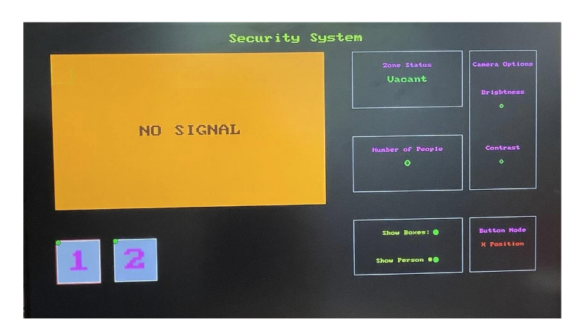

## Projects

### [ZYNQ Ring PUF (Github repo)](https://github.com/JosephBerman/ZYQN-Ring-PUF)

### [CookAware   ](cook.md) 

### [SenchaCam   ](sencha.md)

### [Boomba Security System   ](bomba.md)

### [FPGA Serial Injection   ](fpgainjection.md)

### [RIVeR Lab   ](river.md)

