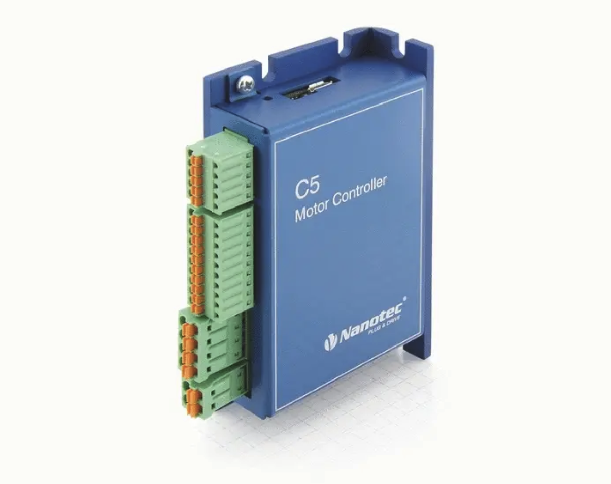

## Projects

### [ZYNQ Ring PUF   ](./puf/puf.md)
Security through differences in silicon crystals.

### [CookAware   ](cook.md) 
My capstone project creating a safer and smarter kitchen.

### [SenchaCam   ](sencha.md)
Creating my own camera network to see my cat from anywhere.

### [Boomba Security System   ](bomba.md)
Writing drivers to display images through HDMI.

### [FPGA Serial Injection   ](fpgainjection.md)
Stealthily injecting data into a serial message.

### [RIVeR Lab   ](river.md)
Moving robots one rail at a time. 
