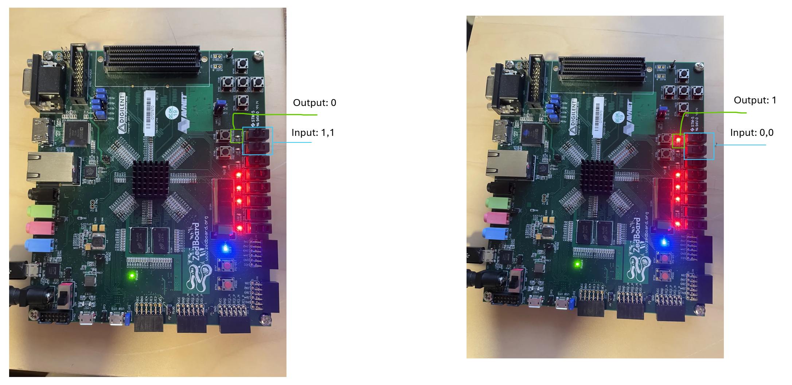

# ZYNQ Ring Oscillating Physical Unclonable Function

[Check out the project on Github!](https://github.com/JosephBerman/ZYNQ-Ring-PUF)

## Abstract

To create a secure, randomly generated number, Physical Unclonable Functions (PUFs), are used. This project used a Ring Oscillating (RO) PUF to create a random yet repeatable bit. By using a Field Programmable Gate Array (FPGA), a RO PUF was synthesized to compare the speed of Look Up Tables (LUTs). The speed of the LUTs will be slightly different due to the entropy in the formation of silicon. These LUTs would then create a clock signal at a slightly different frequency. Counting the clock signals and selecting the fastest creates a random bit. 

## Background

For computers, it is important to be able to generate a random number that is truly random. When computers use pseudorandom functions, they seem to get a random number, however, if the seed for said functions is found out, then you can find the output. For day-to-day uses, this is acceptable (I.E. Rolling Dice), but for security purposes, you never want your initial seed to be known. If the pseudorandom function was used to create an AES key, an attacker can work backward to find the seed used to create the key. This is where PUFs come into play. 

What makes PUFs special is even to the manufacturer of them, the output will be unknown. They will generate a random output based on the minute differences in silicon during IC fabrication. An interesting property is that given a challenge, PUFS should always return the same answer. This may seem contradictory to creating randomness however, the randomness comes from the fact that every chip will return a different, yet re-creatable answer.  For example, take a hard drive that has an onboard encryption chip. When mass-produced, every hard drive will have the same chip, however, they all will have a different encryption key that is derived from the PUF. 

## Design

This PUF gets its name by oscillating multiple clock singles and selecting the fastest one after being selected from a challenge bit. Once the clock signal that is selected for the challenge starts, two counters begin for a set amount of time then compare the values and will decide to output a 1 or 0. 

## Implementation

### Inverters
The first part created as the chain of inverters to oscillate the clock signal. Modern Hardware Description Language IDEs will optimize when routing the logic to FPGA. Vivado will decide to reuse the same inverters as they all do the same thing. This saves space on the FPGA's valuable LUTs. However, because we are racing the silicon, there must be multiple physical chains of inverters on the board.

### Mux Selection
The next part was to create a mux and counter, which consisted of half of the total active logic. This was created by linking 4 chains of inverters to a 4 x 1 mux with a 2-bit select. This mux would then output into a counter. The next image has two inputs and two outputs. The first input is from the race clock signal, and the other is the 2-bit mux enable. Then the counter will output a 32-bit output. The last output is a debug probe. 

### Top Level

At the top level, we have to manage more than just the function logic. A clock signal needs control logic, to start, stop, and reset. The counters also require additional control logic to function correctly. With the control logic in place, we can add the two mux selecting blocks together with the compare logic to output our random bit. 

## Simulation

Simulating a PUF is tricky. The goal is to try to use silicon imperfections to create a function. But in simulations, the logic behaves as if the silicon was all the same. In addition, the rapid clock signals inverting an incredible amount of times, demanded more powerful resources that were not available for use. The image of the simulation below shows ensuring the counter and timing logic is correct. The inputs are as follows: CLK is the base clock for the system. SCLR would reset the counter values. CE is the clock enabled for the inverters. time_stop is the end of the challenge timer which will disable the counters. The output is the current count value in one of the counters. (In this example, it was based on the system clock instead of the inverting chains.)

## Testing on the board

It worked! The switches that are in the blue box control the mux selection while the green box is the random bit output. The other lights and switches were used for the behavior controls. 

## Results

The FPGA was able to get semi-reliable PUF outputs. This could be due to many different outside factors, such as the temperature of the board, the voltage, the current, or similar. Further steps would include learning how to limit the effect of unknown variables on the output. 

## Conclusion

The results show that FPGAs have the potential to be used as PUFs in security practices. More research on external factors and mitigating them is required for a consistent result. This project only created one random bit but it can be scaled up to have more bits to create a secure system. A bigger FPGA with more LUTs is more suited to accommodate the space required for such logic. 

## Reflection

I enjoyed putting my knowledge of PUFs and FPGAs together. I got a deeper understanding of the mapping of logic onto an FPGA. In the past, I would just let Vivado handle the logic routing, which here I still did, but I had to be conscious of its locations and ensure they were consistently placed at the same locations. The PUF can recreate the same output if it's using the same silicon, but due to the nature of the function, using other silicon isn't possible. 

#### References
___
Created in Vivado

[Used digilent .xdc constraints file for zedboard for guidance](https://github.com/Digilent/digilent-xdc/blob/master/Zedboard-Master.xdc)

[Logic diagram](https://asecuritysite.com/random/puf)       