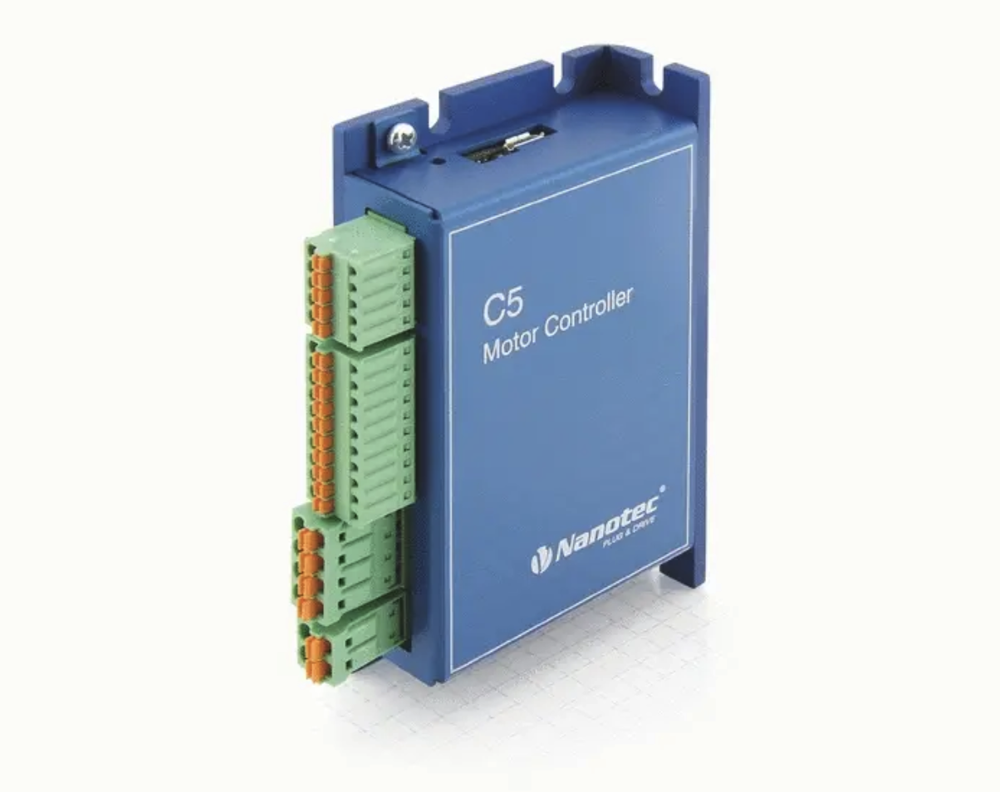

## Robotics and Intelligent Vehicles Research Laboratory 

### Student research at RIVeR

During my undergraduate I participated in research at the Robotics and Intelligent Vehicles Research Laboratory (RiVER).

I contributed to creating a Python ROS driver wrapper for Nanotec C5-E motor controllers. A Python library was provided from Nanotec which the base of the wrapper. 

The motor controller would accept messages over CAN protocol. The controller accepts an address to write to, then the value to be inserted. The ROS wrapper would take external commands from other nodes and direct it to the motor controller. 

