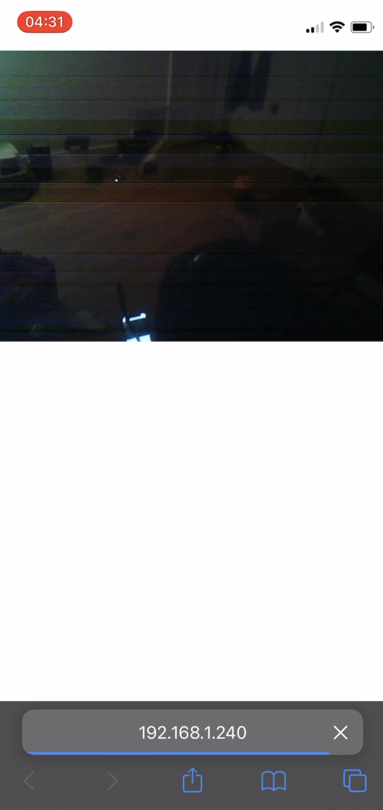
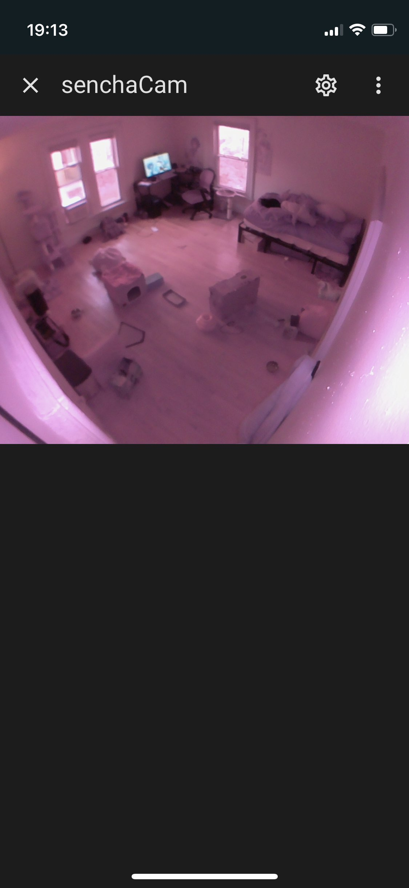

## SenchaCam

### Remote Cat Viewer

My cat likes to get into trouble, pretty frequently. To ensure that he's behaving nicely I made a quick camera network utilizing Cloudflare Zero Trust and [MotionEyeOS](https://github.com/motioneye-project/motioneyeos).

### The Nodes

I used three different devices for the setup. 

#### ESP32-Cam

The first was an ESP32-Cam, which acted as an IP camera. This would publish a video feed to the local network. [The github repo for the IP camera software I used can be found here.](https://jameszah.github.io/ESP32-CAM-VideoCam/)

This consisted of an ESP32-Cam, external antenna, and powered by a micro-USB. Below is a picture of the output of one the ESP32-Cams.

#### Raspberry Pi Zero W

This ran a similar IP camera software. However, this used a much higher quality camera with infrared for night time. The Pi Zero could handle the higher bandwidth required for the more powerful camera. 

Pictured is the not very pretty Raspberry Pi Zero W with the camera module. 

#### Raspberry Pi 4

To display my wonderful cat to the world my Raspberry Pi 4 was running MotionEyeOS. This would connect to the other cameras and display them to the local network.

Pictured is my phone connecting to MotionEyeOS and watching the camera stream. You can see my cat Sencha on the bed. 

Later after moving the Raspberry Pi 4 was replaced with an exterprise server, HPE ProLiant DL 360P.

### Cloudflare Zero Trust Tunnel

To connect my camera to the outside world I used Cloudflare Zero Trust Tunnel. This would allow anyone to access my camera feeds without exposing a network port.  